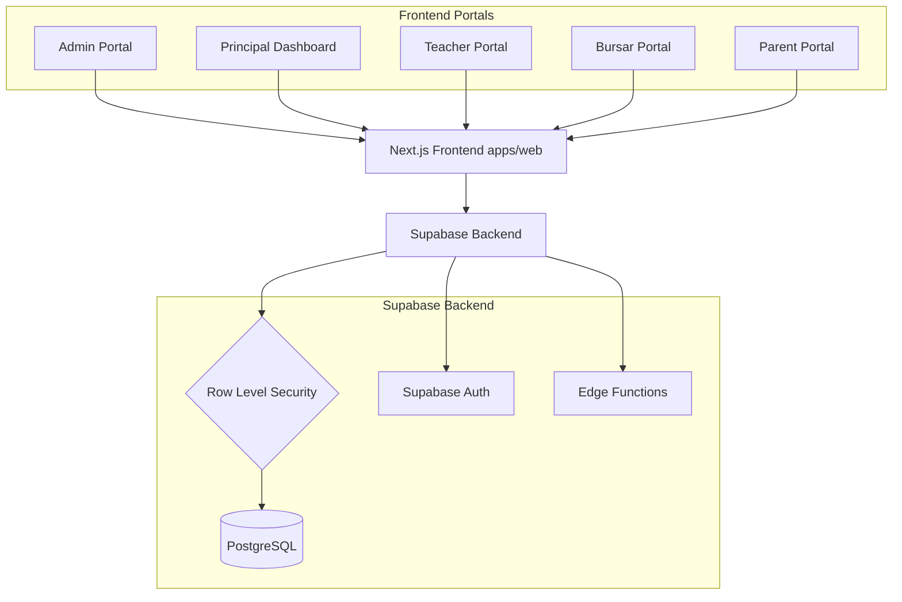
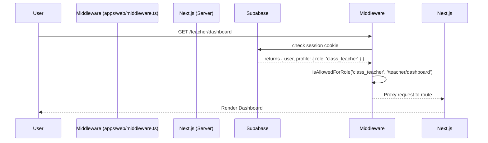

# Architecture

## The Big Picture
EduTrack is built as a scalable monorepo. The core application logic is served by Next.js, while data persistence, real-time subscriptions, and security rules are handled by Supabase.

### Module Dependency Graph

## Repository Structure
- `apps/web/`: The Next.js 16 (App Router) application serving all portals.
- `backend/supabase/`: Database schemas, migrations (`production_migration.sql`), and Edge Functions.
- `docs/`: The documentation you are currently reading.

> **Note:** The PRD mentions an `apps/mobile/` Expo app for parents, but this has not yet been built. The Next.js web application is currently fully responsive and serves mobile users.

## Core Request Flow: Auth & Routing

## Where State Lives
- **Primary Data:** Supabase PostgreSQL (handles users, schools, invoices, attendance, exams).
- **Session State:** Secure HTTP-only cookies (`sb-access-token`, `sb-refresh-token`).
- **Files/Media:** (Planned) Supabase Storage for profile pictures and PDF report cards.
