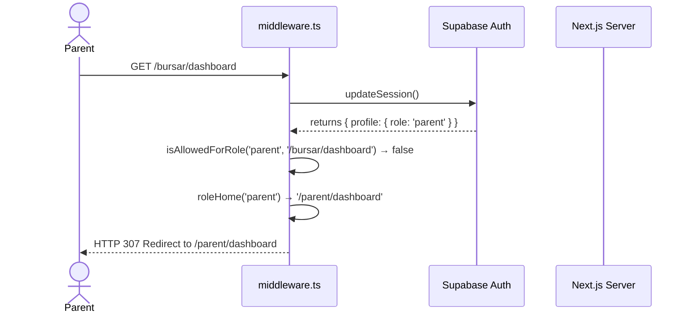
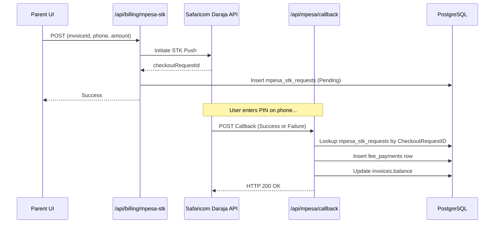

# Architecture

EduTrack is built as a single Next.js web application utilizing Supabase (PostgreSQL) for persistence, authentication, and security.

---

## System Component Map

```mermaid
graph TD
    Browser[Browser] --> Middleware[Next.js Edge: middleware.ts]
    Middleware --> Auth[Supabase Auth - session cookies]
    Middleware --> App[Next.js App Router]
    
    App --> DB[(Supabase PostgreSQL + RLS)]
    
    App --> Mpesa[Safaricom Daraja API - M-Pesa]
    Mpesa --> |Callback| Webhook[/api/mpesa/callback]
    Webhook --> DB

    Cron[Vercel Cron] --> |Generate Invoices| CronRoute[/api/cron/generate-invoices]
    CronRoute --> DB
```

---

## Repository Structure

```
EduTrack/
├── apps/
│   └── web/                      # The entire Next.js product
│       ├── app/                  # Next.js App Router pages
│       │   ├── (auth)/           # Login, Signup, Invite flows
│       │   ├── (dashboard)/      # Principal portal
│       │   ├── teacher/          # Teacher portal
│       │   ├── bursar/           # Bursar portal
│       │   ├── parent/           # Parent portal
│       │   ├── library/          # Librarian portal
│       │   ├── store/            # Storekeeper portal
│       │   ├── transport/        # Transport matron portal
│       │   ├── admin/            # Platform owner portal
│       │   └── api/              # Webhooks and cron jobs
│       ├── lib/                  # Server-side utilities
│       │   ├── supabase/         # server.ts, admin.ts, middleware.ts
│       │   └── utils.ts
│       ├── components/           # UI components (shadcn)
│       └── middleware.ts         # Edge route guard and session refresh
├── backend/
│   └── supabase/
│       ├── migrations/           # Database schema (.sql files)
│       └── config.toml
```

> **Note on Mobile:** The PRD mentions a React Native / Expo application (`apps/mobile`), but it has not been initialized. The current platform relies on the responsive Next.js web application for mobile users (Parents).

---

## Critical Request Flow: Routing & Auth Guard

Because 9 distinct roles share the same domain, preventing unauthorized access across portals is handled at the network edge via `middleware.ts`.


```mermaid
sequenceDiagram
    actor Parent
    participant Middle as middleware.ts
    participant SupaAuth as Supabase Auth
    participant Next as Next.js Server

    Parent->>Middle: GET /bursar/dashboard
    Middle->>SupaAuth: updateSession()
    SupaAuth-->>Middle: returns { profile: { role: 'parent' } }
    Middle->>Middle: isAllowedForRole('parent', '/bursar/dashboard') → false
    Middle->>Middle: roleHome('parent') → '/parent/dashboard'
    Middle-->>Parent: HTTP 307 Redirect to /parent/dashboard
```

**Key Requirement:** The profile fetch in `middleware.ts` executes on every request. It must remain lightweight. Do not cache this profile payload, otherwise role demotions will not take immediate effect.

---

## Critical Request Flow: M-Pesa Payments

M-Pesa payments (for school fees) are initiated client-side but resolved asynchronously via a webhook.


```mermaid
sequenceDiagram
    participant Parent UI
    participant Route as /api/billing/mpesa-stk
    participant Daraja as Safaricom Daraja API
    participant Webhook as /api/mpesa/callback
    participant DB as PostgreSQL

    Parent UI->>Route: POST (invoiceId, phone, amount)
    Route->>Daraja: Initiate STK Push
    Daraja-->>Route: checkoutRequestId
    Route->>DB: Insert mpesa_stk_requests (Pending)
    Route-->>Parent UI: Success

    Note over Daraja,Webhook: User enters PIN on phone...

    Daraja->>Webhook: POST Callback (Success or Failure)
    Webhook->>DB: Lookup mpesa_stk_requests by CheckoutRequestID
    Webhook->>DB: Insert fee_payments row
    Webhook->>DB: Update invoices.balance
    Webhook-->>Daraja: HTTP 200 OK
```

[Link: /admin/dashboard]
